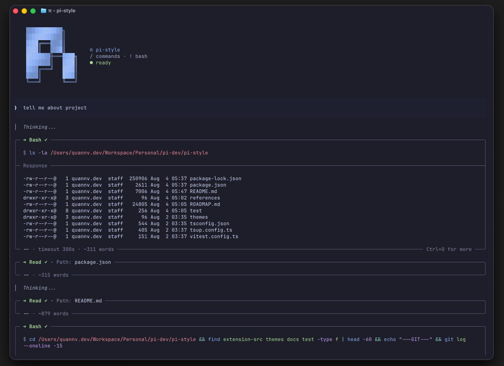

# @quandev104/pi-style

[](https://www.npmjs.com/package/@quandev104/pi-style)
[](LICENSE)

> Pi extension for a cohesive, native-layout visual system across the startup view, status line, editor, messages, and tool presentation. Pi keeps ownership of the feed, scrolling, selection, and terminal layout; pi-style installs components into supported surfaces.

---



---

## Features

- **Status line** — responsive segment layout (model, thinking, path, Git, context, usage, cost, time, extension statuses) through native widgets above or below the editor.
- **Editor** — compact/boxed/dock `CustomEditor` treatments with prompt glyph, metadata rows, and thinking-level border, preserving Pi keybindings and autocomplete.
- **Startup** — compact gradient logo header and optional overlay with System & Context / Available Tools panels, rendered from snapshot data collected before mount.
- **Messages** — assistant prefix and boxed compaction/skill/branch/MCP special blocks, and certified tool call/result selectors with pending/running/error markers.
- **One visual system** — shared semantic theme, glyph sets (Nerd/Unicode/ASCII), and ANSI-safe rendering across every surface.

All certified surfaces are **on by default**. The single OFF switch is:

```json
{ "compatibility": { "allowCorePatches": false } }
```

---

## Install

```bash
pi install npm:@quandev104/pi-style
```

Run a real TUI session with the extension source (development):

```bash
pi -e ./extension-src/pi-style/pi/index.ts
```

---

## Quick start

No configuration is required. The `default` preset enables:

- primary status row **below the editor** (`placement: "below"`), secondary row when it has content;
- `compact` editor with metadata ownership resolved so the status line and editor do not duplicate text;
- `compact` startup header (gradient logo block only; resource chips are opt-in);
- certified message prefixes and boxed tool presentation when compatible with the exact Pi version.

Override any documented leaf through global/project `piStyle` settings, environment, or session commands. Precedence:

```text
defaults < global < project < env < session override
```

Example settings file (`.pi/pi-style` or global config):

```json
{
  "piStyle": {
    "preset": "full",
    "placement": "above",
    "editor": { "style": "boxed", "frame": "line" },
    "startup": { "mode": "overlay", "showResources": true }
  }
}
```

Invalid values never break startup: they fall back safely and appear in `/pi-style doctor` diagnostics.

---

## Presets

| Preset | Behavior |
|---|---|
| `default` | Balanced status line, compact editor, compact startup, restrained message/tool styling. |
| `minimal` | Path/Git/context essentials, native-like editor, no startup overlay, low decoration. |
| `compact` | High information density for medium terminals. |
| `full` | Broad status data and all compatible visual surfaces. |
| `ascii` | No Nerd Font assumptions and conservative separators. |
| `native` | Active Pi theme plus only low-risk status enhancements. |

---

## Configuration

The full schema, precedence, persistence, and migration policy live in [`docs/CONFIGURATION.md`](docs/CONFIGURATION.md). Summary:

### Environment variables

| Variable | Description |
|---|---|
| `PI_STYLE_DISABLED=1` | Disable all surfaces for emergency recovery. |
| `PI_STYLE_NERD_FONTS=1\|0` | Force glyph mode. |
| `PI_STYLE_EDITOR=native\|compact\|boxed\|dock` | Temporary editor override. |
| `PI_STYLE_STATUS=above\|below\|off` | Temporary status placement/state. |
| `PI_STYLE_OSC11=1\|0` | Force terminal background sync policy. |
| `PI_STYLE_DEBUG=1` | Enable bounded diagnostics. |

### CLI flags

Tier C surfaces are immutable session authorizations, not persisted config:

```bash
--pi-style-core-patches
--pi-style-message-assistant
--pi-style-message-special-blocks
--pi-style-tools
--pi-style-ascii
```

---

## Commands

| Command | Description |
|---|---|
| `/pi-style` | Show active preset, surfaces, placement, glyph mode, and compatibility summary. |
| `/pi-style on\|off` | Toggle the package for the current session or selected persistence scope. |
| `/pi-style preset <name>` | Apply a named preset. |
| `/pi-style placement above\|below` | Move the primary status row. |
| `/pi-style editor <style> [frame]` | Select compact, boxed, dock, or native editor. |
| `/pi-style startup <off\|compact\|overlay>` | Select startup mode. |
| `/pi-style surface <name> on\|off` | Toggle startup/status/editor/messages/tools. |
| `/pi-style set <path> <JSON>` | Set one documented leaf after validation, e.g. `set statusLine.layout.left ["model","git"]`. |
| `/pi-style persist global\|project set <path> <JSON>` | Persist the same validated mutation to the selected durable scope. |
| `/pi-style reload` | Re-read configuration and reinstall affected surfaces. |
| `/pi-style doctor` | Show capability/conflict/fallback diagnostics. |

Ordinary mutations are session-only; persistence requires an explicit `global` or `project` scope, and project writes require trust.

---

## Compatibility

- Public Pi APIs (widgets, editor, header, footer bridge) are preferred and enabled by default.
- Tier C core patches (message prefixes, special blocks, tool selectors) are certified for exact Pi `0.83.0` within `>=0.83.0 <0.84.0`, isolated, reversible, and version/capability gated; native fallback otherwise.
- No render-time I/O: filesystem, Git, settings, and session data flow through cached providers into immutable snapshots.
- Terminal-global background synchronization is unsupported/off for technical v1; explicit cell backgrounds and Pi theme APIs remain supported.

---

## Architecture

```text
shared → domain → features → app → pi
```

```text
extension-src/pi-style/
├── shared/     ANSI/width, box, elapsed, split-diff, render-budget, theme extras
├── domain/     config, theme, status presets/renderer, authorization
├── features/   status-line, editor, startup, messages, tools
├── app/        runtime, snapshot, scheduler, providers, commands, doctor
└── pi/         Pi event handlers, session coordinator, compatibility probe
```

Layer boundaries are enforced by dependency-cruiser.

---

## Documentation

Start with [`docs/README.md`](docs/README.md), then the product, architecture, and testing contracts. UI surface contracts live under [`docs/ui/`](docs/ui/README.md), and accepted decisions under [`docs/decisions/`](docs/decisions/README.md). The phase-by-phase plan is in [`ROADMAP.md`](ROADMAP.md).

---

## Development

```bash
npm ci
npm run typecheck
npm run lint
npm run depcruise
npm test
npm run build
npm run check
```

`npm run check` runs all required automated gates in order.

Current test suite: 195 tests across 18 files.

---

## License

[MIT](LICENSE)
